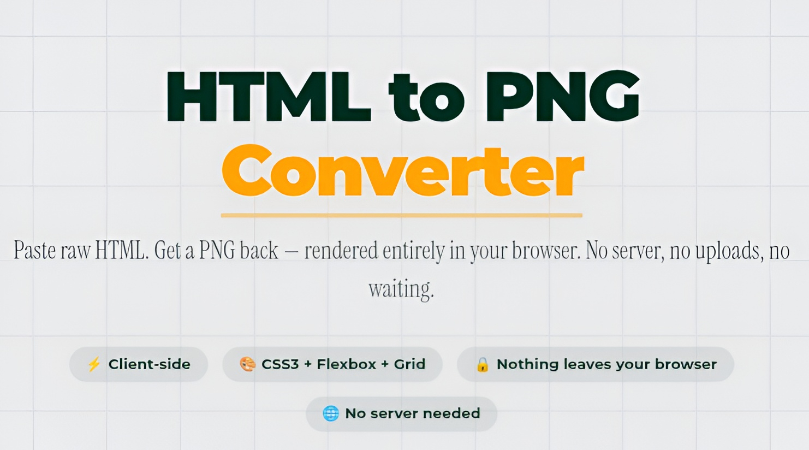

# Render Flow



## Objective

The objective of this project is to provide a purely client-side HTML-to-PNG converter. Built with React, Vite, and `dom-to-image-more`, it allows users to paste or write HTML code and seamlessly convert it into a PNG image without the need for any backend server or rendering engines like Puppeteer or Playwright. The conversion is done efficiently and securely within the user's browser using a hidden iframe approach.

## Features

- **100% Client-Side Processing**: No backend servers are required, ensuring data privacy and fast execution.
- **Robust Rendering**: Uses `dom-to-image-more` under the hood for accurate HTML capturing.
- **Dimension Extraction**: Intelligently parses `width` and `height` dimensions from inline styles or `<style>` blocks in the provided HTML.
- **Lazy Loading**: Client-side heavy dependencies are dynamically loaded for a fast initial page load.

## Project Structure

| Directory / File | Description |
| --- | --- |
| `public/` | Contains static assets like the `favicon.ico` which are served as-is. |
| `src/` | Main source code directory containing React components, hooks, and styles. |
| `src/App.jsx` | The main React component assembling the application's layout. |
| `src/main.jsx` | The entry point for the React application, bootstrapping it into the DOM. |
| `src/components/` | Reusable React components such as `Header`, `Hero`, `InputCard`, `OutputCard`, etc. |
| `src/hooks/` | Custom React hooks like `useHtmlToPngConversion.js` for handling the conversion logic and state. |
| `src/styles/` | Global styles (`globals.css`) and component-specific CSS modules (`Home.module.css`). |
| `For readme.jpg` | Application preview image used in this README. |
| `package.json` | Defines project dependencies, metadata, and scripts. |
| `vite.config.js` | Configuration file for the Vite build tool. |
| `vitest.config.js` | Configuration file for Vitest, the testing framework used in this project. |

## Development

The project uses `npm` for dependency management. To set up and run the project locally:

1. **Install dependencies:**
   ```bash
   npm ci
   ```

2. **Start the development server:**
   ```bash
   npm run dev
   ```

3. **Build for production:**
   ```bash
   npm run build
   ```

## Testing

Testing is done using `vitest` and `@testing-library/react`. To run the tests:

```bash
npx vitest run
```
