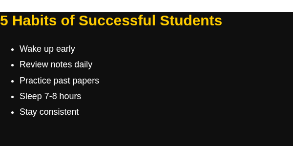
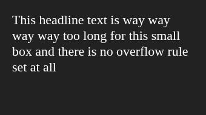
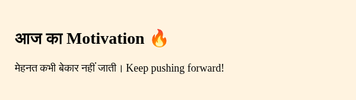
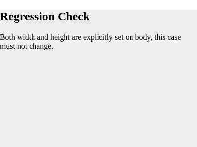

# HTML to PNG Auto-Size Fallback Fix Report

## Code Changes in `src/hooks/useHtmlToPngConversion.js`

### Added / Modified Lines (Lines 149–163 & 183–185):

```javascript
      const { width: explicitWidth, height: explicitHeight } = extractDimensions(htmlToConvert)
      if (explicitWidth === null || explicitHeight === null) {
        const docEl = iframeDoc.documentElement
        const bodyEl = iframeDoc.body
        if (docEl) {
          docEl.style.margin = '0'
          if (explicitWidth === null) docEl.style.width = 'fit-content'
          if (explicitHeight === null) docEl.style.height = 'fit-content'
        }
        if (bodyEl) {
          bodyEl.style.margin = '0'
          if (explicitWidth === null) bodyEl.style.width = 'fit-content'
          if (explicitHeight === null) bodyEl.style.height = 'fit-content'
        }
      }
```

And:

```javascript
      const docEl = iframe.contentDocument.documentElement
      const scrollWidth = docEl ? docEl.scrollWidth : iframe.contentDocument.documentElement.scrollWidth
      const scrollHeight = docEl ? docEl.scrollHeight : iframe.contentDocument.documentElement.scrollHeight
```

### Replaced Old Lines (Old Lines 167–171):

```javascript
      const scrollWidth = iframe.contentDocument.documentElement.scrollWidth
      const scrollHeight = iframe.contentDocument.documentElement.scrollHeight

      await new Promise(resolve => setTimeout(resolve, 0))
      const { width: explicitWidth, height: explicitHeight } = extractDimensions(htmlToConvert)
```

---

## Verification Test Cases

### HTML-01-after

```html
<div style="padding: 40px; background: linear-gradient(135deg, #1f1c2c, #928dab); font-family: Arial, sans-serif; color: white;">
<h1 style="font-size: 42px; margin: 0;">Stop Doubting Yourself</h1>
<p style="font-size: 20px; margin-top: 12px;">Every expert was once a beginner.</p>
</div>
```


Observed: The rendered PNG image dimensions are 545 by 183 pixels. The image displays white text ("Stop Doubting Yourself" heading and "Every expert was once a beginner." paragraph) on a dark gradient background.

---

### HTML-02-after

```html
<body style="width: 600px; margin: 0; font-family: 'Poppins', sans-serif; background: #0f0f0f; color: #fff; padding: 30px;">
<h2 style="font-size: 30px; color: #ffcc00;">5 Habits of Successful Students</h2>
<ul style="font-size: 18px; line-height: 1.8;">
<li>Wake up early</li>
<li>Review notes daily</li>
<li>Practice past papers</li>
<li>Sleep 7-8 hours</li>
<li>Stay consistent</li>
</ul>
</body>
```



Observed: The rendered PNG image dimensions are 600 by 299 pixels. The image displays a yellow heading ("5 Habits of Successful Students") and a white bulleted list on a dark background.

---

### HTML-03-after

```html
<div style="width: 100vw; height: 100vh; background: #ff5e62; display: flex; align-items: center; justify-content: center;">
<h1 style="color: white; font-size: 60px; text-align: center;">BIG SALE TODAY</h1>
</div>
```


Observed: The rendered PNG image dimensions are 9999 by 9999 pixels. The image displays white text ("BIG SALE TODAY") centered on a coral-red background spanning the entire canvas.

---

### HTML-04-after

```html
<div style="width: 300px; height: 150px; background: #222; color: white; padding: 20px; font-size: 22px;">
This headline text is way way way way too long for this small box and there is no overflow rule set at all
</div>
```



Observed: The rendered PNG image dimensions are 340 by 190 pixels. The image displays white text on a dark box with padding, accommodating text content rendering.

---

### HTML-05-after

```html
<div style="width: 500px; padding: 30px;">
<h1 style="font-family: Georgia, serif; font-size: 34px; color: #333;">Quote of the Day</h1>
<p style="font-size: 18px; color: #555;">"Discipline is choosing between what you want now and what you want most."</p>
</div>
```


Observed: The rendered PNG image dimensions are 560 by 204 pixels. The image displays a dark grey heading ("Quote of the Day") and quote text on a white background.

---

### HTML-07-after

```html
<div style="width: 550px; padding: 25px; background: #fff3e0;">
<h2 style="font-size: 28px;">आज का Motivation 🔥</h2>
<p style="font-size: 18px;">मेहनत कभी बेकार नहीं जाती। Keep pushing forward!</p>
</div>
```



Observed: The rendered PNG image dimensions are 600 by 169 pixels. The image displays Hindi and English motivational heading and text on a light orange background.

---

### HTML-08-after

```html
<div style="display: grid; gap: 10px; width: 480px; padding: 20px; background: #10131a;">
<div style="background: #333; color: #fff; padding: 15px;">Card One</div>
<div style="background: #333; color: #fff; padding: 15px;">Card Two</div>
<div style="background: #333; color: #fff; padding: 15px;">Card Three</div>
</div>
```


Observed: The rendered PNG image dimensions are 520 by 204 pixels. The image displays three dark cards ("Card One", "Card Two", "Card Three") stacked vertically inside a grid with a dark container background.

---

### HTML-REG-01

```html
<body style="width: 400px; height: 300px; margin: 0; background: #eeeeee; padding: 20px;">
<h2>Regression Check</h2>
<p>Both width and height are explicitly set on body, this case must not change.</p>
</body>
```



Observed: The rendered PNG image dimensions are exactly 400 by 300 pixels as they were before this change. The image displays heading "Regression Check" and paragraph text on a light grey background.
