# Stress Test Report: Render Flow Conversion Pipelines

## Summary Table

| Test ID | Mode | Target / Focus Area |
| :--- | :--- | :--- |
| HTML-01 | HTML | CSS gradient background with inline padding and custom fonts |
| HTML-02 | HTML | Full body tag wrap with fixed width, Google Font reference, and styled unordered list |
| HTML-03 | HTML | Viewport dimensions (100vw/100vh) with flexbox center alignment |
| HTML-04 | HTML | Fixed container height with overflowing text and no overflow rules |
| HTML-05 | HTML | Standard card layout with serif typography and paragraph quotation |
| HTML-06 | HTML | Profile card containing broken local image reference |
| HTML-07 | HTML | Unicode Devanagari script (Hindi text) with emoji characters |
| HTML-08 | HTML | CSS Grid layout with gap property and dark theme cards |
| MERMAID-01 | Mermaid | Basic flowchart with decision syntax and cycle path |
| MERMAID-02 | Mermaid | Left-to-right flowchart syntax (LR) with multi-node chain |
| MERMAID-03 | Mermaid | Sequence diagram with actors, notes, and solid/dotted arrows |
| MERMAID-04 | Mermaid | Flowchart with extreme unformatted node text length |
| MERMAID-05 | Mermaid | Pie chart layout with key-value labels and percentages |
| MERMAID-06 | Mermaid | Gantt timeline chart with sections, dates, and task durations |
| MERMAID-07 | Mermaid | Class diagram with typed fields, methods, and relationship multiplicity |
| LATEX-01 | LaTeX | Unclosed math delimiter syntax error |
| LATEX-02 | LaTeX | 3x3 matrix block without explicit inline math delimiters |
| LATEX-03 | LaTeX | Unmatched fraction brace inside inline square root expression |
| LATEX-04 | LaTeX | Deeply nested display-math continued fraction expression |
| LATEX-05 | LaTeX | Unsupported mhchem macro (\ce) chemical equation |
| LATEX-06 | LaTeX | Mixed inline text, raw Unicode symbols, and valid inline math expression |
| LATEX-07 | LaTeX | Custom \newcommand macro definition in math mode |

---

## Test Results

### HTML-01 (HTML)

```html
<div style="padding: 40px; background: linear-gradient(135deg, #1f1c2c, #928dab); font-family: Arial, sans-serif; color: white;">
<h1 style="font-size: 42px; margin: 0;">Stop Doubting Yourself</h1>
<p style="font-size: 20px; margin-top: 12px;">Every expert was once a beginner.</p>
</div>
```


Observed: The preview meta display shows "9999 × 9999px". The rendered image file measures 9999 × 9999 pixels, displaying a purple-to-grey linear gradient rectangle positioned in the upper-left corner with white heading text reading "Stop Doubting Yourself" and paragraph text reading "Every expert was once a beginner." set against a transparent background fill for the remaining canvas area.

---

### HTML-02 (HTML)

```html
<body style="width: 600px; margin: 0; font-family: 'Poppins', sans-serif; background: #0f0f0f; color: #fff; padding: 30px;">
<h2 style="font-size: 30px; color: #ffcc00;">5 Habits of Successful Students</h2>
<ul style="font-size: 18px; line-height: 1.8;">
<li>Wake up early</li>
<li>Review notes daily</li>
<li>Practice past papers</li>
<li>Sleep 7-8 hours</li>
<li>Stay consistent</li>
</ul>
</body>
```

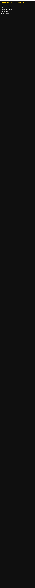

Observed: The preview meta display shows "600 × 9999px". The rendered image file measures 600 × 9999 pixels, displaying a dark charcoal rectangle at the top with yellow heading text "5 Habits of Successful Students" and five white bullet points ("Wake up early", "Review notes daily", "Practice past papers", "Sleep 7-8 hours", "Stay consistent") over a transparent canvas extending below.

---

### HTML-03 (HTML)

```html
<div style="width: 100vw; height: 100vh; background: #ff5e62; display: flex; align-items: center; justify-content: center;">
<h1 style="color: white; font-size: 60px; text-align: center;">BIG SALE TODAY</h1>
</div>
```


Observed: The preview meta display shows "10007 × 10015px". The rendered image file measures 10007 × 10015 pixels, filled entirely by a solid coral-red rectangle containing centered white heading text reading "BIG SALE TODAY".

---

### HTML-04 (HTML)

```html
<div style="width: 300px; height: 150px; background: #222; color: white; padding: 20px; font-size: 22px;">
This headline text is way way way way too long for this small box and there is no overflow rule set at all
</div>
```


Observed: The preview meta display shows "9999 × 9999px". The rendered image file measures 9999 × 9999 pixels, featuring a dark grey box measuring 300px wide in the upper-left corner with white text that overflows vertically past the bottom edge of the 150px-high container box against a transparent canvas background.

---

### HTML-05 (HTML)

```html
<div style="width: 500px; padding: 30px;">
<h1 style="font-family: Georgia, serif; font-size: 34px; color: #333;">Quote of the Day</h1>
<p style="font-size: 18px; color: #555;">"Discipline is choosing between what you want now and what you want most."</p>
</div>
```


Observed: The preview meta display shows "9999 × 9999px". The rendered image file measures 9999 × 9999 pixels, containing dark grey heading text reading "Quote of the Day" in serif font and grey paragraph text reading "\"Discipline is choosing between what you want now and what you want most.\"" against a transparent background.

---

### HTML-06 (HTML)

```html
<div style="width: 400px; background: #fafafa; padding: 20px; text-align: center;">

<h3 style="font-family: Arial;">Aman Sharma</h3>
<p style="color: #777;">Educator & Content Creator</p>
</div>
```

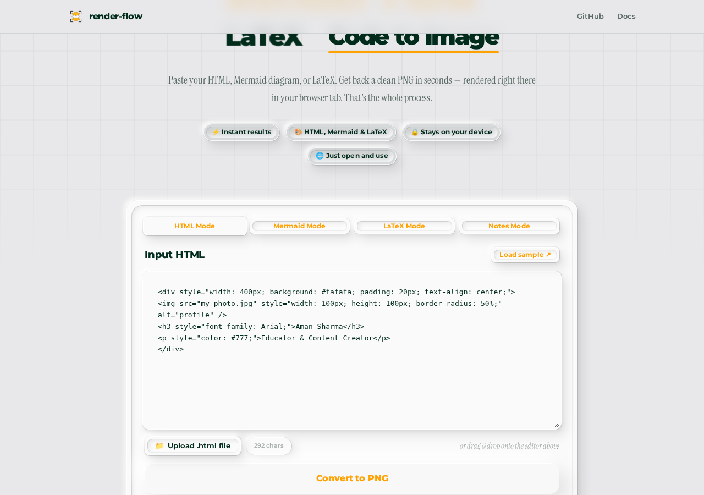

Observed: An error card display appears on screen containing the text "⚠ Rendering failed Rendering failed. Try inlining external assets as data: URLs." No output PNG preview or download action is rendered.

---

### HTML-07 (HTML)

```html
<div style="width: 550px; padding: 25px; background: #fff3e0;">
<h2 style="font-size: 28px;">आज का Motivation 🔥</h2>
<p style="font-size: 18px;">मेहनत कभी बेकार नहीं जाती। Keep pushing forward!</p>
</div>
```


Observed: The preview meta display shows "9999 × 9999px". The rendered image file measures 9999 × 9999 pixels, displaying a light orange background block in the top-left corner containing heading text reading "आज का Motivation 🔥" and paragraph text reading "मेहनत कभी बेकार नहीं जाती। Keep pushing forward!" set against a transparent background.

---

### HTML-08 (HTML)

```html
<div style="display: grid; gap: 10px; width: 480px; padding: 20px; background: #10131a;">
<div style="background: #333; color: #fff; padding: 15px;">Card One</div>
<div style="background: #333; color: #fff; padding: 15px;">Card Two</div>
<div style="background: #333; color: #fff; padding: 15px;">Card Three</div>
</div>
```


Observed: The preview meta display shows "9999 × 9999px". The rendered image file measures 9999 × 9999 pixels, displaying a dark background rectangle containing three vertically stacked dark grey card boxes labeled "Card One", "Card Two", and "Card Three" separated by 10px gaps against a transparent background.

---

### MERMAID-01 (Mermaid)

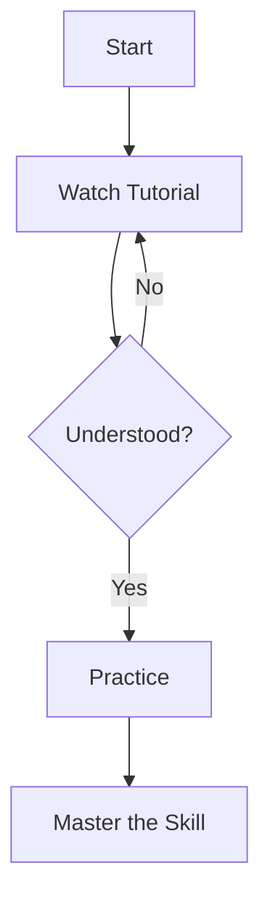
```mermaid
graph
    A[Start] --> B[Watch Tutorial]
    B --> C{Understood?}
    C -->|Yes| D[Practice]
    C -->|No| B
    D --> E[Master the Skill]
```

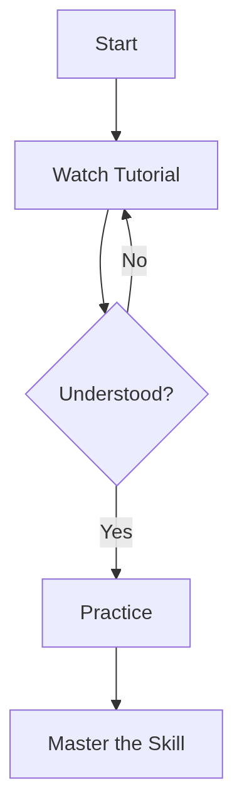

Observed: The preview meta display shows "370.75 × 1251.25px". The rendered image file measures 370 × 1251 pixels, displaying a top-to-bottom flowchart diagram with nodes labeled "Start", "Watch Tutorial", "Understood?", "Practice", and "Master the Skill" connected by directional arrows with edge labels "Yes" and "No".

---

### MERMAID-02 (Mermaid)

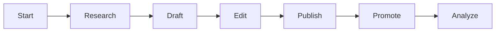
```mermaid
flowchart LR
    Start --> Research
    Research --> Draft
    Draft --> Edit
    Edit --> Publish
    Publish --> Promote
    Promote --> Analyze
```


Observed: The preview meta display shows "2140.8125 × 140px". The rendered image file measures 2140 × 140 pixels, displaying a horizontal left-to-right flowchart diagram connecting nodes labeled "Start", "Research", "Draft", "Edit", "Publish", "Promote", and "Analyze" with arrows.

---

### MERMAID-03 (Mermaid)

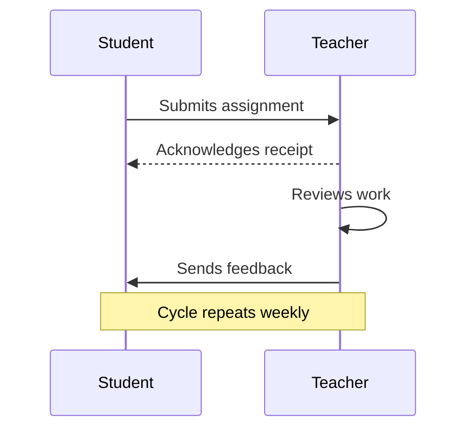
```mermaid
sequenceDiagram
    Student->>Teacher: Submits assignment
    Teacher-->>Student: Acknowledges receipt
    Teacher->>Teacher: Reviews work
    Teacher->>Student: Sends feedback
    Note over Student,Teacher: Cycle repeats weekly
```

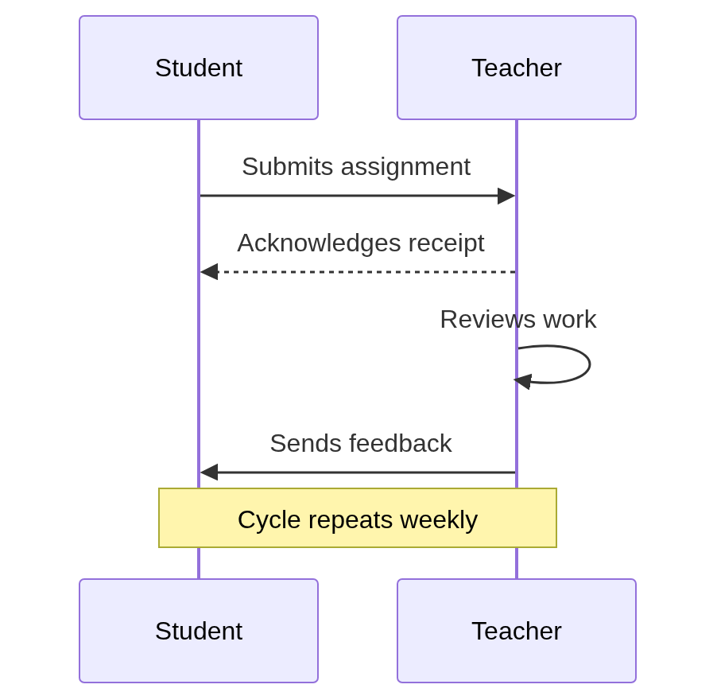

Observed: The preview meta display shows "902 × 880px". The rendered image file measures 902 × 880 pixels, displaying a sequence diagram with lifeline columns for "Student" and "Teacher", arrow messages "Submits assignment", "Acknowledges receipt", "Reviews work", and "Sends feedback", and a note box spanning both lifelines reading "Cycle repeats weekly".

---

### MERMAID-04 (Mermaid)

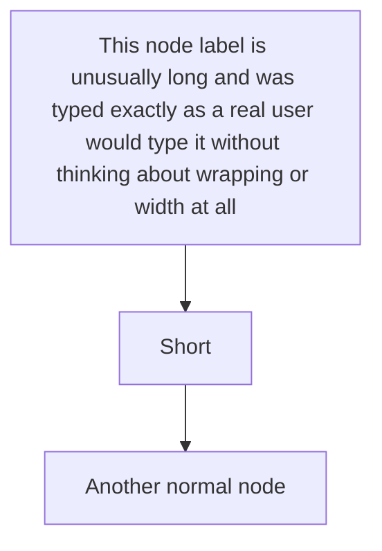
```mermaid
flowchart TD
    A[This node label is unusually long and was typed exactly as a real user would type it without thinking about wrapping or width at all] --> B[Short]
    B --> C[Another normal node]
```

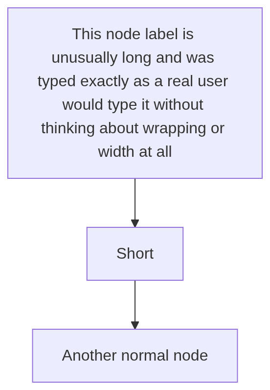

Observed: The preview meta display shows "552 × 796px". The rendered image file measures 552 × 796 pixels, displaying a top-down flowchart where node A contains multi-line wrapped text reading "This node label is unusually long and was typed exactly as a real user would type it without thinking about wrapping or width at all" connected to nodes labeled "Short" and "Another normal node".

---

### MERMAID-05 (Mermaid)

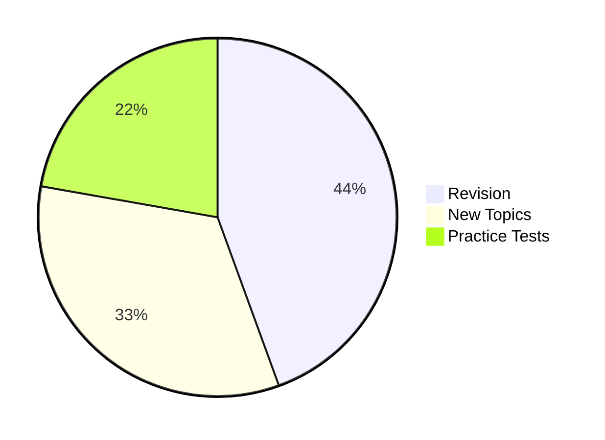
```mermaid
pie
    "Revision" : 20
    "New Topics" : 15
    "Practice Tests" : 10
```

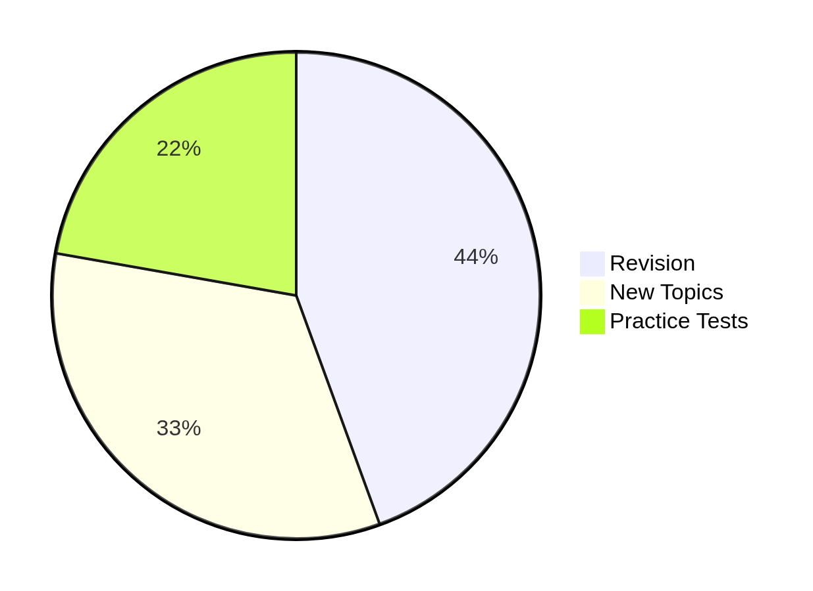

Observed: The preview meta display shows "1235.03125 × 900px". The rendered image file measures 1235 × 900 pixels, displaying a circular pie chart divided into three colored slices labeled "Revision", "New Topics", and "Practice Tests" with exact percentage values in a side legend.

---

### MERMAID-06 (Mermaid)

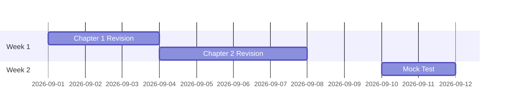
```mermaid
gantt
    section Week 1
    Chapter 1 Revision :a1, 2026-09-01, 3d
    Chapter 2 Revision :after a1, 4d
    section Week 2
    Mock Test :2026-09-10, 2d
```

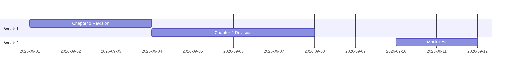

Observed: The preview meta display shows "2560 × 344px". The rendered image file measures 2560 × 344 pixels, displaying a Gantt timeline chart with horizontal section bars for "Week 1" ("Chapter 1 Revision", "Chapter 2 Revision") and "Week 2" ("Mock Test") mapped against date columns from September 2026.

---

### MERMAID-07 (Mermaid)

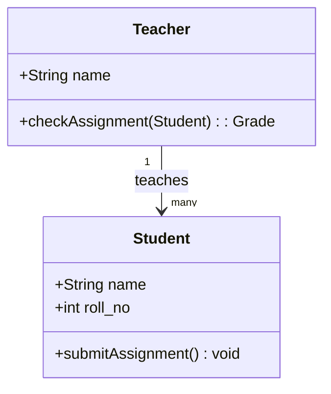
```mermaid
classDiagram
    class Student {
        +String name
        +int roll_no
        +submitAssignment() void
    }
    class Teacher {
        +String name
        +checkAssignment(Student) : Grade
    }
    Teacher "1" --> "many" Student : teaches
```

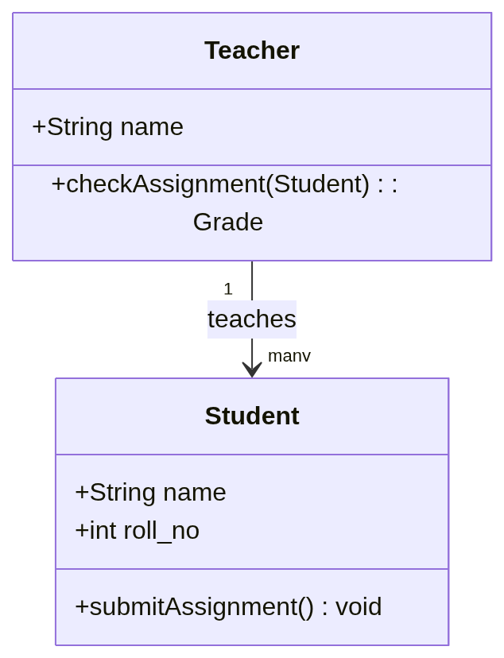

Observed: The preview meta display shows "634.1875 × 828px". The rendered image file measures 634 × 828 pixels, displaying two class diagram boxes for "Student" and "Teacher" with listed attributes/methods and a connecting association arrow labeled "1" to "many" with annotation "teaches".

---

### LATEX-01 (LaTeX)

```latex
The quadratic formula is $x = \frac{-b \pm \sqrt{b^2 - 4ac}}{2a and this part was never closed.
```

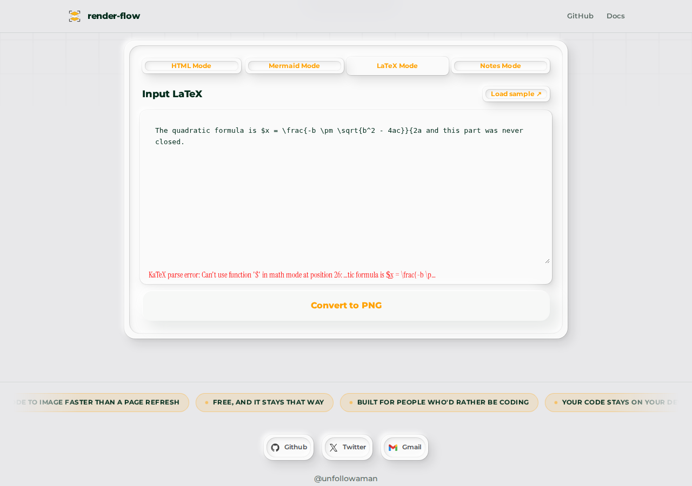

Observed: An inline text message in red color appears beneath the input field reading "KaTeX parse error: Can't use function '$' in math mode at position 26: …tic formula is $̲x = \frac{-b \p…". No preview or output image is produced.

---

### LATEX-02 (LaTeX)

```latex
\begin{bmatrix}
1 & 2 & 3 \\
4 & 5 & 6 \\
7 & 8 & 9
\end{bmatrix}
```

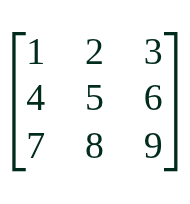

Observed: The preview meta display shows "190 × 204px". The rendered image file measures 190 × 204 pixels, displaying a 3x3 matrix enclosed in square brackets with entries 1 to 9 against a transparent background.

---

### LATEX-03 (LaTeX)

```latex
$\sqrt{\frac{a+b}{c-d}$
```

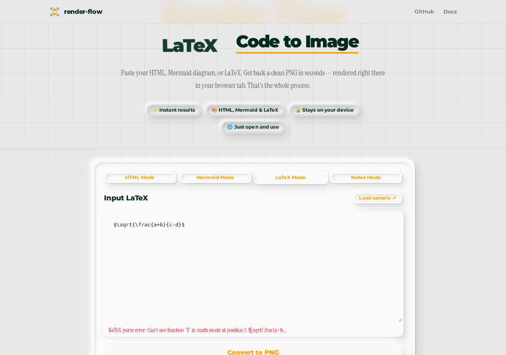

Observed: An inline text message in red color appears beneath the input field reading "KaTeX parse error: Can't use function '$' in math mode at position 1: $̲\sqrt{\frac{a+b…". No preview or output image is produced.

---

### LATEX-04 (LaTeX)

```latex
$$\frac{1}{1+\frac{1}{1+\frac{1}{1+\frac{1}{1+\frac{1}{2}}}}}$$
```

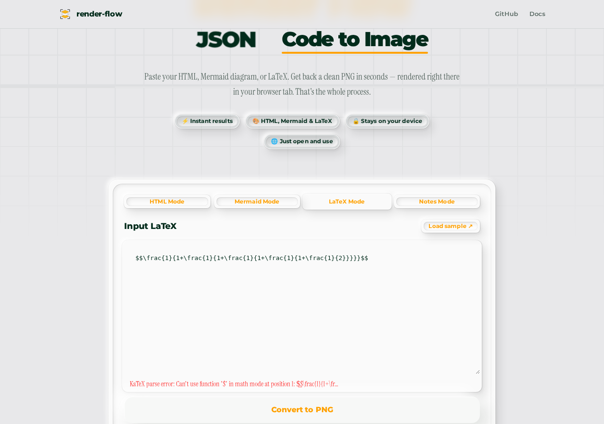

Observed: An inline text message in red color appears beneath the input field reading "KaTeX parse error: Can't use function '$' in math mode at position 1: $̲$\frac{1}{1+\fr…". No preview or output image is produced.

---

### LATEX-05 (LaTeX)

```latex
$\ce{2H2 + O2 -> 2H2O}$
```

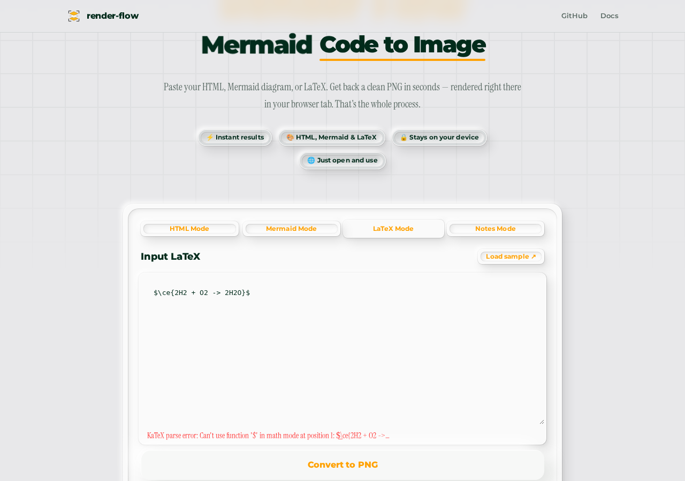

Observed: An inline text message in red color appears beneath the input field reading "KaTeX parse error: Can't use function '$' in math mode at position 1: $̲\ce{2H2 + O2 ->…". No preview or output image is produced.

---

### LATEX-06 (LaTeX)

```latex
The value of π ≈ 3.14159, and the area is $A = \pi r^2$, so A ± 0.01 is acceptable.
```

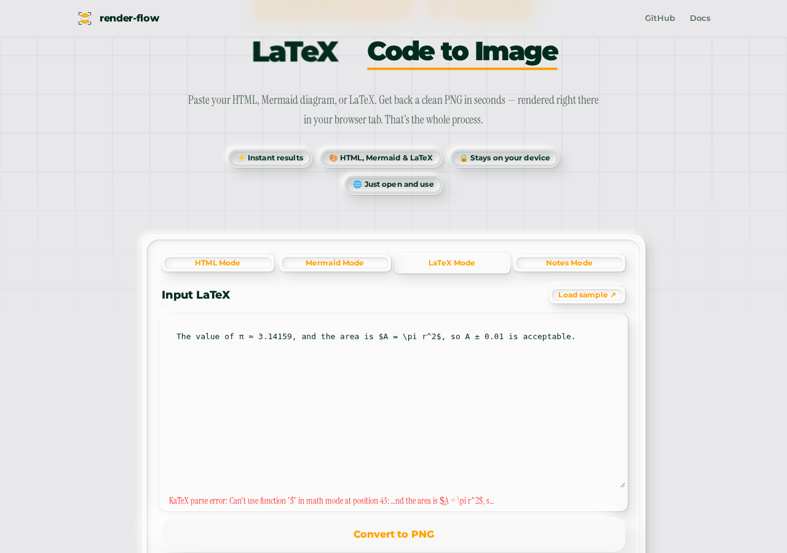

Observed: An inline text message in red color appears beneath the input field reading "KaTeX parse error: Can't use function '$' in math mode at position 43: …nd the area is $̲A = \pi r^2$, s…". No preview or output image is produced.

---

### LATEX-07 (LaTeX)

```latex
$\newcommand{\R}{\mathbb{R}} f: \R \to \R \text{ is continuous}$
```

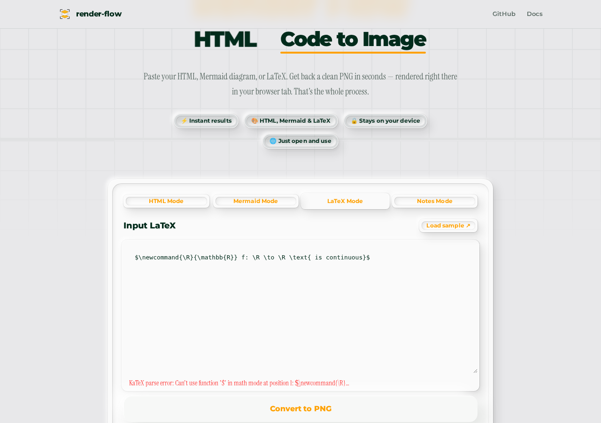

Observed: An inline text message in red color appears beneath the input field reading "KaTeX parse error: Can't use function '$' in math mode at position 1: $̲\newcommand{\R}…". No preview or output image is produced.
